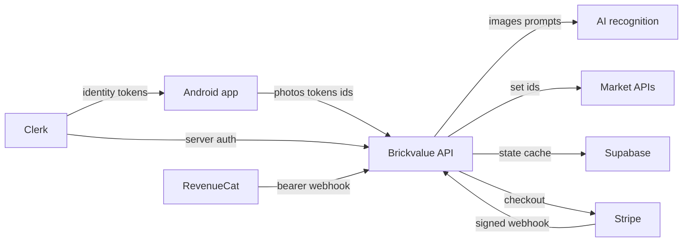

## Executive summary
BrickVal's highest-risk areas are the public hosted API routes that receive photos, call paid third-party services, and update Pro access. The biggest launch risks are abuse of unauthenticated scan/lookup routes, payment entitlement spoofing, and over-large image uploads causing cost or availability problems. This pass also hardened the RevenueCat webhook, scan image intake, and Android permissions.

## Scope and assumptions
- In scope: `brickval-mobile/app`, `brickval-mobile/components`, `brickval-mobile/lib`, `brickval-mobile/app.json`, hosted backend files under `../src/app/api`, `../src/lib`, and `../supabase/schema.sql`.
- Out of scope: native iOS launch, EAS/Play Console account security, third-party dashboard configuration beyond required secrets, and unrelated UI polish.
- Assumption: beta can allow loose or unlimited scans, but launch should enforce 1 free scan per day for free users server-side.
- Assumption: `https://brickvalue.live` is the production backend and all sensitive third-party API keys stay on that backend.
- Assumption: Clerk is the identity source of truth, Supabase stores scan/Pro/account state, and RevenueCat will be used for production native subscriptions.
- Open question: RevenueCat production webhook config still needs verification in the dashboard with `REVENUECAT_WEBHOOK_SECRET`.

## System model
### Primary components
- Native Expo app: camera/photo capture, Clerk auth, local collection storage, RevenueCat/Superwall paywall, and API calls. Evidence: `lib/api.ts` uses `API_BASE = "https://brickvalue.live"` and attaches Clerk bearer tokens; `app/_layout.tsx` wires Clerk, RevenueCat, and Superwall.
- Hosted Next.js backend: route handlers for identify, lookup, account deletion, Stripe webhook, RevenueCat webhook, bulk lookup, and part colors. Evidence: `../src/app/api/identify/route.ts`, `../src/app/api/lookup/route.ts`, `../src/app/api/webhook/route.ts`, `../src/app/api/webhook/revenuecat/route.ts`.
- Data stores and external services: Supabase `users`, `api_cache`, `waitlist`; Clerk; Stripe; RevenueCat; Anthropic Vision; Brickognize; BrickLink; eBay; Brickset; Frankfurter. Evidence: `../supabase/schema.sql`, `../src/lib/supabase.ts`, `../src/lib/bricklink.ts`, `../src/lib/ebay.ts`, `../src/lib/frankfurter.ts`.

### Data flows and trust boundaries
- Mobile app -> Hosted API: scan photos, set/minifig/part identifiers, Clerk bearer tokens over HTTPS. Auth is optional for beta lookup paths; validation exists for modes, file type, size, and identifier format. Evidence: `lib/api.ts`, `../src/app/api/identify/route.ts`, `../src/app/api/lookup/route.ts`.
- Hosted API -> AI/recognition providers: uploaded images or cropped images sent to Anthropic or Brickognize over HTTPS. API key is server-only for Anthropic; Brickognize is called from backend. Evidence: `../src/app/api/identify/route.ts`, `../src/lib/anthropic.ts`.
- Hosted API -> market-data providers: sanitized identifiers sent to BrickLink, eBay, Brickset, and Frankfurter over HTTPS. Secrets load from server env vars. Evidence: `../src/lib/bricklink.ts`, `../src/lib/ebay.ts`, `../src/lib/brickset.ts`.
- Hosted API -> Supabase: service-role client updates scan counts, Pro status, waitlist emails, and cache. RLS is enabled and app code uses service role only server-side. Evidence: `../src/lib/supabase.ts`, `../supabase/schema.sql`.
- Stripe/RevenueCat -> Hosted webhooks: signed Stripe events and bearer-auth RevenueCat events update `users.is_pro`. Evidence: `../src/app/api/webhook/route.ts`, `../src/app/api/webhook/revenuecat/route.ts`.
- Native app -> Device storage: SecureStore stores onboarding, guest scan counters, avatar choice, and local collection data. Evidence: `lib/collection.ts`, `app/(tabs)/scan.tsx`, `app/(tabs)/settings.tsx`.

#### Diagram

## Assets and security objectives
| Asset | Why it matters | Security objective (C/I/A) |
|---|---|---|
| Clerk user IDs and session tokens | Control account identity and account deletion | C/I |
| `users.is_pro` and `scans_used` | Controls paid access and free-plan limits | I/A |
| Supabase service role key | Full database bypass of RLS | C/I |
| Stripe and RevenueCat webhook trust | Converts payment events into Pro access | I |
| Uploaded scan photos | User-provided images may contain private background content | C |
| Third-party API keys and quotas | Paid services can be abused for cost or outage | C/A |
| API cache | Drives displayed pricing and reduces upstream usage | I/A |
| Android release artifacts | Users install these binaries | I |

## Attacker model
### Capabilities
- Remote unauthenticated user can call public API routes and upload images.
- Signed-in free user can obtain a valid Clerk token and repeatedly call scan/lookup APIs.
- Network attacker can observe domains but should not break HTTPS.
- Payment attacker can attempt forged webhooks or mismatched user IDs.
- Malicious beta tester can reverse engineer public mobile config and call backend APIs directly.

### Non-capabilities
- Attacker cannot read server env vars unless deployment or logs leak them.
- Attacker cannot forge Clerk auth, Stripe signatures, or RevenueCat bearer auth if secrets are configured correctly.
- Attacker does not have Supabase service-role access or third-party dashboard admin access.
- Attacker cannot directly write native SecureStore on another user's device.

## Entry points and attack surfaces
| Surface | How reached | Trust boundary | Notes | Evidence |
|---|---|---|---|---|
| `/api/identify` | Multipart image POST | Internet -> backend -> AI providers | Accepts JPEG/PNG/WebP only, caps image size, validates mode | `../src/app/api/identify/route.ts` |
| `/api/lookup` | JSON POST | Internet -> backend -> market APIs/Supabase | Sanitizes identifiers; beta free access remains loose | `../src/app/api/lookup/route.ts` |
| `/api/bulk-lookup` | Authenticated JSON POST | Signed-in user -> backend -> market APIs | Caps to 20 sets and batches by 3 | `../src/app/api/bulk-lookup/route.ts` |
| `/api/part-colors` | GET | Internet -> backend -> BrickLink | No auth; can cause repeated upstream calls if not cached upstream | `../src/app/api/part-colors/route.ts` |
| `/api/delete-account` | Authenticated POST | Signed-in user -> Supabase/Clerk | Deletes own Supabase row and Clerk account | `../src/app/api/delete-account/route.ts` |
| Stripe webhook | Stripe POST | Stripe -> backend -> Supabase | Signature verification uses raw body | `../src/app/api/webhook/route.ts` |
| RevenueCat webhook | RevenueCat POST | RevenueCat -> backend -> Supabase | Bearer secret now required; only `pro` entitlement affects Pro status | `../src/app/api/webhook/revenuecat/route.ts` |
| Mobile local collection | Device storage | Device user -> SecureStore | Local-only MVP data; no backend sync | `lib/collection.ts` |
| Android permissions | Installed app -> device OS | Native app -> camera | Microphone permission removed; camera and vibration remain | `app.json` |

## Top abuse paths
1. Free lookup abuse: attacker scripts `/api/lookup` or `/api/identify`, consumes market/AI quota, and increases operating cost because beta access is intentionally loose.
2. Image upload DoS: attacker uploads large or malformed images to force memory/CPU work before provider calls. Mitigated by file type and 5 MB cap, with crop retries capped.
3. Payment spoofing: attacker posts fake RevenueCat events to grant Pro. Mitigated by mandatory bearer secret and `pro` entitlement check.
4. Webhook metadata mismatch: real payment event lacks Clerk metadata, causing paid user not to get Pro. Stripe logs this; RevenueCat depends on `app_user_id` being the Clerk user ID.
5. Account deletion misuse: attacker with a stolen Clerk token calls delete-account and removes the victim account. Main control is Clerk token security.
6. Provider data poisoning: external market APIs return bad or unexpected content, which gets cached and shown as pricing. Current validation normalizes identifiers and prices, but trust remains provider-dependent.
7. Local data exposure: collection data remains on the phone; anyone with device access can see it inside the app. This is acceptable for MVP but should be disclosed as local-only.

## Threat model table
| Threat ID | Threat source | Prerequisites | Threat action | Impact | Impacted assets | Existing controls (evidence) | Gaps | Recommended mitigations | Detection ideas | Likelihood | Impact severity | Priority |
|---|---|---|---|---|---|---|---|---|---|---|---|---|
| TM-001 | Remote unauthenticated user | Public API reachable; beta allows loose scan limits | Automate identify/lookup calls to burn AI and market API quota | Cost increase, degraded service | API quotas, availability | Identifier validation in `../src/app/api/lookup/route.ts`; upload validation in `../src/app/api/identify/route.ts` | No server-side guest/day limit for launch yet | Before launch, enforce 1 free scan/day server-side by user and anonymous device/IP bucket; keep beta override explicit | Alert on requests per IP/user, provider error spikes, cache miss rate | High in launch | Medium | High |
| TM-002 | Remote unauthenticated user | Can POST images to identify | Upload oversized or malformed images to consume backend memory/CPU | API slowdown or crash | Backend availability | 5 MB cap, accepted types, recovery crop cap in `../src/app/api/identify/route.ts` | No per-IP throttling shown in repo | Add edge/API rate limit and request timeout for image routes | Track 413/415/500 counts, image sizes, route latency | Medium | Medium | Medium |
| TM-003 | Payment attacker | RevenueCat endpoint public | Forge purchase webhook to set `is_pro=true` | Free Pro access, revenue loss | `users.is_pro` | Mandatory `REVENUECAT_WEBHOOK_SECRET`, `Authorization: Bearer`, `pro` entitlement check in `../src/app/api/webhook/revenuecat/route.ts` | Dashboard config must match env secret | Verify RevenueCat dashboard header before production; rotate secret if exposed | Alert on unauthorized webhook attempts and Pro changes | Low if configured | High | Medium |
| TM-004 | Payment/config failure | Stripe or RevenueCat event lacks Clerk user mapping | Legit purchase does not update Pro access, or revocation misses user | Support burden, entitlement drift | `users.is_pro`, revenue trust | Stripe signature verification and metadata lookup in `../src/app/api/webhook/route.ts`; RevenueCat `app_user_id` handling | RevenueCat working status not confirmed | Run test purchase/webhook before production; log and alert missing user IDs | Alert on webhook events with missing `clerk_user_id` or `app_user_id` | Medium | Medium | Medium |
| TM-005 | Signed-in attacker or stolen token | Valid Clerk token for account | Call delete-account endpoint | Account deletion | Clerk account, Supabase user row | `auth()` required and deletes only current `userId` in `../src/app/api/delete-account/route.ts` | No re-auth step before destructive action | Add Clerk re-auth or recent-session check before launch if account deletion abuse becomes likely | Log account deletion user/time/IP | Low | High | Medium |
| TM-006 | Malicious API caller | Knows public endpoints | Enumerate many set/part IDs through lookup routes | Provider quota burn and cache growth | API cache, provider quotas | Lookup inputs are sanitized and capped for bulk route in `../src/app/api/bulk-lookup/route.ts` | Single lookup route has no visible rate limit | Add rate limit and cache write monitoring; keep bulk auth-only | Cache write volume by route and user | Medium | Medium | Medium |
| TM-007 | Third-party provider or bad upstream data | Provider returns bad pricing or HTML-encoded names | Cache and display inaccurate values | User trust and pricing integrity | API cache, pricing UI | Cache TTL and normalization in `../src/lib/cache.ts`, `../src/app/api/lookup/route.ts` | No independent anomaly detection | Add basic sanity checks on price ranges and sudden jumps | Alert on extreme price values and provider failures | Low | Medium | Low |
| TM-008 | Device-local attacker | Physical access to user's unlocked phone | View or clear local collection | Privacy loss for collection contents | Local collection | SecureStore usage in `lib/collection.ts` | No app-level PIN; local-only MVP | Accept for MVP; document local-only storage | Not applicable unless user support reports | Low | Low | Low |

## Criticality calibration
- Critical: unauthenticated path that can directly read service-role data, remote code execution in image parsing, or webhook bypass that grants Pro at scale.
- High: repeatable abuse that creates material API cost, bypasses launch scan limits, or corrupts paid entitlement state.
- Medium: targeted denial of service, entitlement drift for some users, account deletion with a stolen valid token, or quota abuse with operational limits.
- Low: local-only data exposure on an already-unlocked device, provider data quality issues with fallback behavior, or UI leaks of non-sensitive status.

## Focus paths for security review
| Path | Why it matters | Related Threat IDs |
|---|---|---|
| `../src/app/api/identify/route.ts` | Main photo upload and AI-cost entry point | TM-001, TM-002 |
| `../src/app/api/lookup/route.ts` | Main market lookup and scan counter entry point | TM-001, TM-006, TM-007 |
| `../src/lib/scan-gate.ts` | Launch free-plan limit must become 1 free scan/day server-side | TM-001 |
| `../supabase/schema.sql` | Atomic scan counter and user entitlement storage | TM-001, TM-003 |
| `../src/app/api/webhook/revenuecat/route.ts` | Native subscription events update Pro access | TM-003, TM-004 |
| `../src/app/api/webhook/route.ts` | Stripe events update lifetime/subscription Pro status | TM-004 |
| `../src/app/api/delete-account/route.ts` | Destructive authenticated account action | TM-005 |
| `../src/app/api/bulk-lookup/route.ts` | Authenticated batch lookup can amplify provider calls | TM-006 |
| `../src/lib/supabase.ts` | Service-role client must remain server-only | TM-003, TM-004 |
| `brickval-mobile/lib/api.ts` | Native app sends Clerk tokens and scan data to hosted API | TM-001 |
| `brickval-mobile/lib/paywall.ts` | RevenueCat/Superwall identity mapping affects paid access | TM-003, TM-004 |
| `brickval-mobile/app.json` | Native permissions define device-level trust | TM-008 |

## Quality check
- Covered discovered runtime entry points: identify, lookup, bulk lookup, part colors, account deletion, Stripe webhook, RevenueCat webhook, native API client, local storage, and Android permissions.
- Covered trust boundaries: mobile/backend, backend/AI providers, backend/market APIs, backend/Supabase, payment providers/backend, and native/device storage.
- Separated runtime from build/dev artifacts: EAS release artifacts and dashboard configuration are noted as out of scope except where they affect runtime secrets.
- Reflected user clarification: beta currently has no strict scan limit; launch target is 1 free scan/day for free users; RevenueCat will be production path but dashboard status is not confirmed.
- Remaining assumptions are explicit: production webhook secret must be configured, and launch scan limits need a server-side implementation before public launch.
