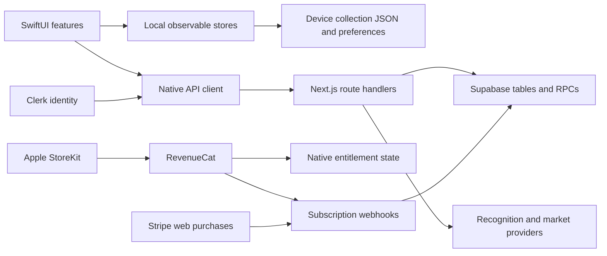
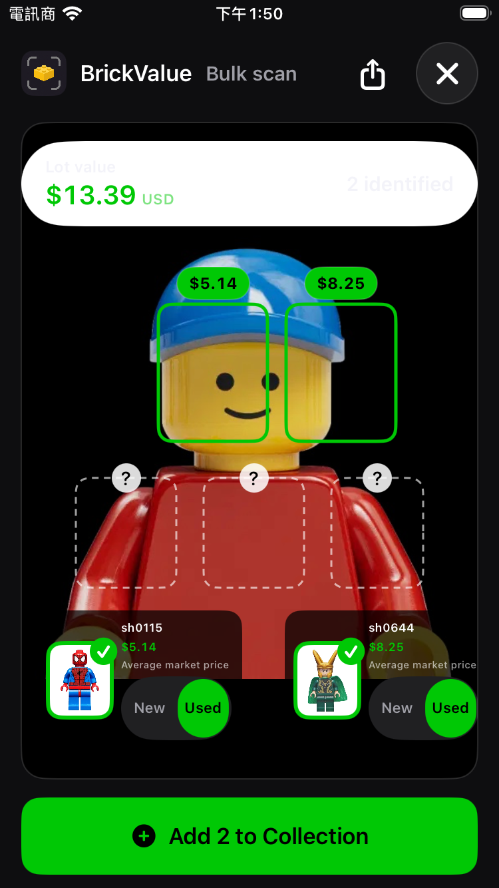
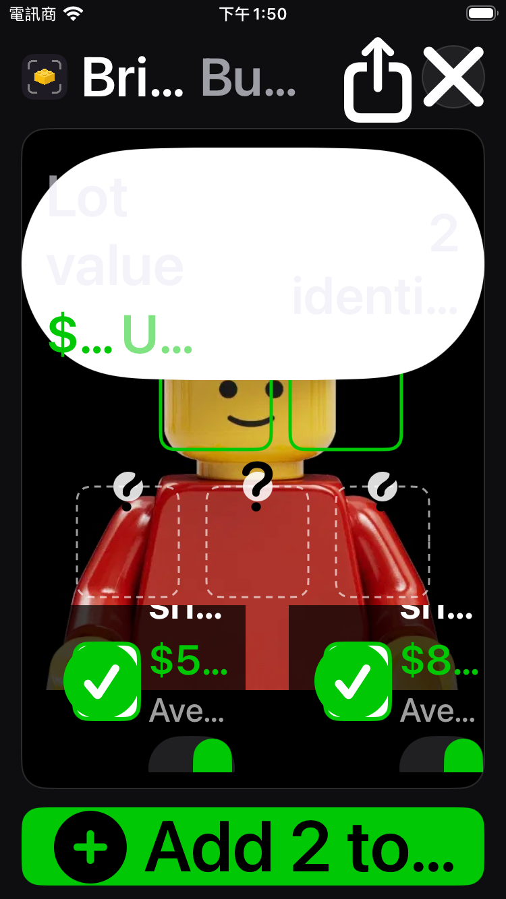

# BrickValue reliability and architecture audit

Date: 2026-09-05. Native baseline: **1.0.7 (167)**, `com.brickval.app`, canonical Swift repository. Referral rule: **three qualified friends → three bulk scans, once per referrer**.

## Verdict

**Not ready for a reliability sign-off.** The existing automated suites pass, but the deployed database is missing schema required by the current release, and targeted tests reproduce reward, scan-access, pricing, and collection-recovery defects.

This report contains **15 prioritized findings: 1 P0, 10 P1, 4 P2**. P0 blocks a current journey; P1 should be corrected before the next release; P2 belongs in the next reliability pass. No product fixes, production writes, migrations, purchases, or new TestFlight uploads were made during this audit.

The most urgent work is to reconcile production migrations, repair referral reward transactions, enforce scan authorization consistently, preserve collections after load failures, and remove invented pricing/history. Dependency patches and subscription correctness also belong before the next release.

## What was verified

| Area / journey | Result | Evidence and limits |
|---|---|---|
| Native unit and UI suites | Passed | 186 Swift tests in 30 suites, 2 XCTest photo-import tests, and 11 UI tests on **each** small and large iPhone simulator; zero failures. UI fixtures are not real-account end-to-end tests. |
| Backend suite / type-check | Passed | 68 tests; TypeScript no-emit check passed. |
| Localization catalog | Passed | 784 app strings and 4 permission strings across 13 locales. Does not certify translation quality or every layout. |
| Sequential referral rewards | Passed locally | Real PostgreSQL: three qualified invitees grant 3 credits; a replay and fourth friend do not add more. Claims alone grant nothing. |
| Concurrent credit spending | Passed locally | Eight simultaneous attempts spend exactly 3 credits; remaining balance is 0. Pro usage bypasses the free allowance. |
| Pro referral-credit preservation | Blocked end-to-end | SQL Pro allowance bypass passed, but real-account entitlement reconciliation and preservation of a nonzero referral balance were not verified. F06 identifies debit-before-reconciliation risk. |
| Concurrent referral qualification | **Failed locally** | Three qualified friends, zero reward rows; retries do not repair it. F03. |
| Referral account/device checks | Partial | Self-referral, invalid codes, duplicate account and duplicate non-null installation rejected. Deleting an account permits reuse of its installation. |
| Production referral contract | **Failed** | Missing installation column and three-argument claim RPC; missing grandfathering fields/RPC. F01. |
| Universal Link configuration | Passed configuration check | Live association responds 200 and identifies the correct app and `/r/*`. Actual TestFlight handoff is blocked by unavailable physical devices. |
| Scan session authorization | **Failed controlled tests** | Anonymous priced requests bypass metering; a denied session later returns a priced result. F04–F05. |
| Subscription lifecycle | **Failed controlled tests** | Product changes and billing issues revoke access; stale renewal overwrites newer expiry; Stripe database failure returns success. F06. Real Apple purchases/restores remain blocked. |
| Pricing and saved collection | **Failed targeted native tests** | eBay-only values decode as absent; history is synthesized; adding after corrupt-file load overwrites the original. F07–F09. Ordinary persistence and write-error reporting passed. |
| Small-screen / accessibility text | **Failed visual smoke** | Build 167: nearly invisible summary labels; largest Dynamic Type clips amounts and controls. F11. |
| Notifications in production | **Failed** | Six returned error logs for registration, all HTTP 500, citing missing `language_code`. |
| Dependency audit | **Failed version check** | Production dependency graph: 17 vulnerable-package entries: 2 critical, 10 high, 4 moderate, 1 low. Entries include propagated dependency findings; not 17 proven exploits. |
| Production runtime review | Partial | Vercel connector disconnected; authenticated CLI succeeded. Requested seven days, returned six errors. Retention/sampling and unavailable Sentry crash data limit completeness. |
| Real account switching, deletion, StoreKit, camera capture | **Blocked end-to-end** | Both known physical iPhones were unavailable; no isolated Clerk/Apple test identities were available. No real user data or rewards were changed. |

The large-simulator instrumented app line coverage is **48.0%**. Coverage includes fixture-driven UI execution and is not a correctness score. The small simulator's original text size and shutdown state were restored.

## Architecture and release consistency



| State | Owner | Main concern |
|---|---|---|
| Identity | Clerk; SDK coordinator propagates identity | Authentication failures sometimes become guest access; cached state needs account-bound verification. |
| Pro entitlement | RevenueCat/StoreKit and Stripe; copied to Supabase `users.is_pro` and native cache | Multiple writers overwrite a single boolean without lifecycle ordering or separate provider ownership. |
| Allowances | Supabase usage RPCs and referral ledger; native policy mirrors them | Session authorization is separate from usage reservation; fallback paths disagree. |
| Referral rewards | SQL attribution/reward/ledger tables | Good ledger and unique milestone foundation, but transaction scope does not serialize the referrer's milestone. |
| Collection | One device-local JSON file | Atomic writes exist; no recovery snapshot, account scoping, or cloud sync. Pull-to-refresh reloads local data, not market values. |
| Prices | Provider payloads → backend normalization → native normalization | Wire fields, selected condition, data provenance, and chart history disagree. |
| Currency | Canonical USD plus backend rates and local converted display | Good separation from Apple subscription prices; rate-age behavior needs a long-running/offline test. |

Archive inspection confirmed build 167 uses `https://brickvalue.live`. Production deployment `dpl_61tWq4fx7KYTwcB2yQKZEZ7oebBe` is READY. The production environment points to the same Supabase instance as the local configuration. Its exposed schema is behind the native/backend source. Exact deployed function bodies and full migration history were not accessible through read-only REST introspection.

The audited working tree contains substantial **pre-existing uncommitted product changes** on top of `73413071740d1111c2f3504210cb3489223700f0`. The inspected deployment response did not expose a source commit. [Source hashes](2026-09-05/source-manifest.json) identify the actual audited files; the Git commit alone does not reproduce this release.

## Findings and specific remedies

### F01 — P0: Production is missing required migrations

**Confirmed live, read-only.** Column probes return PostgreSQL `42703` for `referral_attributions.installation_hash`, `users.bulk_intro_grandfathered`, and `notification_devices.language_code`. The live claim RPC accepts only two arguments; current [referral code](../../src/lib/referrals.ts#L105) sends three. The grandfather-credit RPC is absent. [Production schema evidence](2026-09-05/production-schema.json) and [sanitized production errors](2026-09-05/production-errors.json).

**Impact:** current code cannot reliably claim referrals, restore introductory credit, read signed-in allowance state, or register notifications. The ignored user-query error in [scan-gate.ts](../../src/lib/scan-gate.ts#L145) can misrepresent paid users as free.

**Remedy:** inventory live migration state; prepare a reviewed forward migration for the missing referral/grandfathering and notification fields/functions, with a fixed historical eligibility cutoff. Validate it against both an old-schema fixture and a current-schema fixture before deployment. Do **not** replay the entire schema blindly: its `created_at < now()` backfill grants every already-created account legacy eligibility. Then verify authenticated claim, completion, balances, and notification registration using dedicated accounts.

### F02 — P1: Known vulnerable dependencies in the backend

**Confirmed installed versions; production exploitability not exercised.** Lockfile: Clerk Next.js `6.38.0`, Clerk shared `3.46.0`, Next.js `16.1.6`. The registry audit flags 17 vulnerable-package entries. [Dependency summary](2026-09-05/dependency-summary.json).

**Impact:** the app uses the route-matcher middleware pattern named in Clerk's critical advisory. Separate handler-level authentication remains important. Other dependency advisories require route-specific exposure assessment rather than assuming every advisory is reachable.

**Remedy:** upgrade compatible patched versions and their lockfile together, prioritizing Clerk/shared and Next.js; rerun authentication, SSR, image upload, and backend tests. Do not use an unreviewed forced major upgrade. [Clerk's maintainer advisory](https://github.com/clerk/javascript/security/advisories/GHSA-vqx2-fgx2-5wq9) explains the affected middleware pattern and limits; [Next.js maintainer advisory](https://github.com/vercel/next.js/security/advisories/GHSA-267c-6grr-h53f) covers App Router middleware bypass.

### F03 — P1: Simultaneous referrals can permanently miss the reward

**Reproduced in PostgreSQL using source SQL.** One friend is already qualified. Two independent transactions qualify the second and third and stay open before committing. Each sees only two qualified friends, so neither inserts the reward. Final state: 3 qualified, 0 reward rows. Replaying qualification still yields 0. [SQL function](../../supabase/schema.sql#L574), [observations](2026-09-05/referral-database.json).

**Impact:** users meet the promised milestone but receive no scans. `getReferralStatus` additionally infers `rewardGranted` from the count, so it can claim a grant exists when the ledger has none.

**Remedy:** serialize milestone evaluation on the referrer, use a consistent lock order, and perform qualification, milestone insertion, and ledger grant atomically. Idempotent replays should reconcile missing grants. Derive granted status from the reward/ledger, not just the count. Test concurrent second/third completions and replay repair.

### F04 — P1: Anonymous requests and database errors bypass scan metering

**Reproduced with actual route handlers and controlled boundaries.** An anonymous bulk start returns a token with zero gate calls; anonymous region identification returns pricing with zero debit calls. A simulated database outage returns `allowed: true`. [Start route](../../src/app/api/minifig/bulk-scan/start/route.ts#L54), [scan gate](../../src/lib/scan-gate.ts#L252).

**Impact:** client-side limits do not protect paid recognition/pricing services against direct callers. Auth failures are treated like intentional guest sessions. Public lookup and feedback routes also need a deliberate abuse boundary.

**Remedy:** define and enforce a server-side guest allowance/identity if anonymous scanning remains supported; require verified identity or a bounded authorization grant for billable operations. Return a retryable service failure when authorization cannot be checked. Preserve a documented, bounded policy for verified paid users during outages.

### F05 — P1: A rejected scan session later returns paid results

**Reproduced with the real region handler.** The first successful region obtains the one-use session marker, then its debit is denied: HTTP 402. A subsequent region sees the marker already used and skips authorization: HTTP 200 with a priced candidate. [Region handler](../../src/app/api/minifig/bulk-scan/identify-region/route.ts#L95), [evidence](2026-09-05/backend-behaviors.json).

**Impact:** the session marker records that a request tried to charge, not that the scan was authorized. It is not a durable authorization decision.

**Remedy:** persist a session authorization state with an idempotent credit reservation. Every region must observe authorized, pending, or denied state consistently. Distinguish retries from new scans, and test concurrency, crashes between reservation and response, denied-session replays, and no-result charging behavior.

### F06 — P1: Subscription events can remove valid access or restore expired access

**Reproduced with real webhook handlers and simulated provider/database inputs.** `PRODUCT_CHANGE` and `BILLING_ISSUE` set Pro false. A stale renewal arriving after expiry sets it true. A Stripe database write error returns HTTP 200. [RevenueCat handler](../../src/app/api/webhook/revenuecat/route.ts#L36), [Stripe handler](../../src/app/api/webhook/route.ts#L36).

**Impact:** paid users can lose access during a valid period/grace period, expired users can regain stale access, and failed updates can be acknowledged as successful. The fallback Pro reconciliation does not make the underlying state reliable.

**Remedy:** reconcile against authoritative entitlement state, handle event IDs/order, and retain provider-specific entitlement records before deriving aggregate Pro access. A failed durable update must cause retry. Check Pro entitlement before consuming referral credit. RevenueCat explicitly states that [billing issues and product changes do not themselves mean expiry](https://www.revenuecat.com/docs/integrations/webhooks/event-types-and-fields); [event order can vary](https://www.revenuecat.com/docs/integrations/webhooks/event-flows).

### F07 — P1: Production charts and condition prices contain invented values

**Confirmed source and native execution.** A $100 item without history produces a varying series from $96.50 to $101.40. [Portfolio history builder](../../apps/ios-swift/BrickVal/Features/Collection/PortfolioHistoryBuilder.swift#L57). Detail history also applies sine/cosine changes to supplied historical values. Switching condition estimates Used at 72% of the saved value rather than looking up its actual price. [Detail history](../../apps/ios-swift/BrickVal/Features/Collection/ItemDetailView.swift#L609), [condition conversion](../../apps/ios-swift/BrickVal/Features/Collection/ItemDetailView.swift#L670).

**Impact:** users see fabricated changes presented as market information, and a newly added condition can persist an estimated value without disclosure. Existing tests explicitly expect artificial movement, so a green suite reinforces this defect.

**Remedy:** remove synthetic market movements from production. Display actual dated observations or a clear insufficient-history state. Use condition-specific provider values; show unavailable when missing. If estimated values are ever a product requirement, label them explicitly and keep them out of sold-price claims. Replace the tests that require invented movement.

### F08 — P1: Backend and native price contracts disagree

**Reproduced across actual computation and native decoding.** Backend computation with eBay-only $100 new/$80 used values exposes `ebay_*` fields, which `LookupPricing` does not decode. The computed hero is not serialized. Native preferred values become nil. Stock-field names also differ. A new-only payload returns $100 for Used through fallback. A BrickLink sold price can inherit eBay's `listing` label. [Backend](../../src/lib/compute-pricing.ts#L118), [native pricing](../../apps/ios-swift/BrickVal/Core/Networking/LookupPricing.swift#L16).

**Impact:** valid prices disappear, missing used data becomes a new-condition price, and price source descriptions can be wrong. Saved collection valuations are snapshots; refreshing the collection currently reloads the local file.

**Remedy:** establish explicit per-condition amount, source, availability, and as-of fields; retain compatibility with existing app builds while normalizing both sides. Add provider-combination contract fixtures decoded by the native model. Show snapshot freshness and plan a bounded refresh of saved valuations rather than implying pull-to-refresh fetches market data.

### F09 — P1: A failed collection load can be followed by destructive overwrite

**Reproduced using actual Swift store and repository.** Seed a malformed collection file, load it, then add an item. The load reports an error, but writes remain enabled and the malformed original is replaced by the new collection. [Store](../../apps/ios-swift/BrickVal/Core/Persistence/CollectionStore.swift#L21), [native evidence](2026-09-05/native-behaviors.json).

**Impact:** potentially recoverable saved data is lost. Atomic writes protect individual writes, not this recovery sequence.

**Remedy:** introduce an explicit failed-load state that blocks mutations, preserve a quarantined original plus last-known-good backup, and provide retry/recovery without overwriting. Test corrupt and future-version files, write failures, restart, and recovery. Cloud sync is a separate product project, not necessary for this fix.

### F10 — P1: New accounts can claim legacy introductory credit

**Reproduced locally.** A newly inserted account with no prior usage calls `claim_bulk_intro_grandfathering` with an arbitrary unused installation string and receives true. Re-running the schema also marks newly created users grandfathered. [RPC](../../supabase/schema.sql#L407), [endpoint](../../src/app/api/mobile/monetization/route.ts#L54).

**Impact:** a server benefit intended for pre-rollout installations is granted based on a client assertion. This becomes reachable when the missing production migration is repaired.

**Remedy:** require server-verifiable historical eligibility with a fixed cutoff or trusted prior-install record. Do not use the caller's fresh device string as proof of age. Keep one-time binding and reject new accounts; test migration reruns against post-cutoff users.

### F11 — P1: Bulk summary contrast and accessibility layout fail

**Observed on build 167, small iPhone, English app override.** The white summary uses dark-mode `.secondary` text, making its labels nearly white-on-white. At the largest accessibility text size, amounts and the Add action truncate and condition controls clip. [Summary/rail layout](../../apps/ios-swift/BrickVal/Features/Scan/BulkScanResultsView.swift#L653).

**Impact:** users cannot reliably read the total, identified count, or available actions. The existing UI tests mainly check element existence, not readability or usable bounds.

**Remedy:** choose foreground colors appropriate to the actual summary background; use adaptive vertical layouts and content-sized rails at accessibility sizes. Keep full amounts and primary actions readable. Add screenshot/bounds checks at standard and largest accessibility sizes, including RTL and long-language strings.

| Standard text | Largest accessibility text |
|---|---|
|  |  |

### F12 — P2: Referral restart, retry, and recipient messaging are inconsistent

**Reproduced/source-confirmed.** Reconstructing `AppRouter` loses the pending invite. Concurrent code creation gives one success and one failure because unique-conflict retries never reread the winner. Onboarding treats a nonthrowing claim response as success without checking `claimed`; Profile handles a prior `claimed` status as a generic failure. Qualification messaging tells the invitee that their bonus is ready when the reward belongs to the referrer. [Router](../../apps/ios-swift/BrickVal/App/AppRouter.swift#L12), [creation](../../src/lib/referrals.ts#L43), [Profile](../../apps/ios-swift/BrickVal/Features/Settings/ReferralView.swift#L456).

**Impact:** an invite can disappear during sign-in or restart, retries can show false failure, and the wrong person can be told they earned credits.

**Remedy:** persist pending codes and account-bound completion retries; reread the active code after a uniqueness conflict; distinguish idempotent prior claims from rejection; correct recipient copy. Test lost responses, force-quit during sign-in, switching accounts, and retries after onboarding. Add bounded claim rate limiting and deliberate handling for omitted installation IDs.

### F13 — P2: Account deletion has partial-failure and abuse-retention gaps

**Database behavior reproduced; full Clerk journey unverified.** Deleting an invitee cascades away their installation attribution and allows that installation to claim again. The endpoint deletes Supabase data before Clerk; native deletion clears the collection afterward. Failures can leave these stores disagreeing. [Database foreign keys](../../supabase/schema.sql#L48), [deletion endpoint](../../src/app/api/delete-account/route.ts#L14), [native deletion](../../apps/ios-swift/BrickVal/Features/Settings/ClerkAccountContentView.swift#L53).

**Impact:** account deletion may be incomplete, and repeated deletion/re-registration weakens the one-installation referral safeguard.

**Remedy:** make deletion an idempotent recoverable workflow and report partial progress accurately. Define the minimal, privacy-reviewed anti-abuse retention policy rather than keeping deleted users' personal data indefinitely. Reconcile referral status from reward records when invitees disappear. Verify native account controls use the coordinated deletion path, including third-party profile controls.

### F14 — P2: Release provenance and test gates are insufficient

**Confirmed repository/configuration inspection.** No repository CI workflow or unified full backend test command was found. Database/route contract tests were missing. Active docs still describe scan limits as stubbed. Build 167 was generated from a dirty tree containing new source files not yet tracked in Git; the deployment response lacks a source commit.

**Impact:** a successful archive/test run can ship incompatible backend/database state, and the exact release cannot be reconstructed from the recorded commit alone.

**Remedy:** release from a reviewed commit, record source SHA/build/deployment/migration versions together, and add CI gates for backend tests, native tests, localization, dependency review, and isolated migration/contract tests. Use reviewed migration artifacts with a compatibility check before enabling dependent features. Update active documentation after the fixes land.

### F15 — P2: Cache failures can silently increase provider traffic

**Reproduced with actual cache module and database errors.** Supabase `delete` and `upsert` return error objects; `setCached` ignores them and resolves without a warning. [Cache](../../src/lib/cache.ts#L59). Provider inspection also found timeout coverage differs: recognition is bounded, while several BrickLink/eBay/currency fetches lack explicit abort deadlines.

**Impact:** requests may repeatedly call paid/rate-limited providers while appearing healthy, and slow providers can occupy request capacity.

**Remedy:** inspect every database result, record bounded cache-write failures, and expose provider/cache health separately from user success. Add per-provider deadlines and deduplicate concurrent cache fills. Test database errors, slow providers, and unavailable rate services. Keep genuine stale fallback data subject to explicit maximum age.

## Further risks requiring verification

- **Identity isolation:** entitlement and pending-onboarding preferences are device-scoped; RevenueCat login/logout errors are suppressed. Test account A → sign-out → B with slow/failing identity transitions before asserting an entitlement leak.
- **Currency aging:** cache age is checked during initialization, but failure handling retains in-memory rates. Verify a session spanning the seven-day cutoff and repeated stale payloads; availability and freshness must be independent.
- **Collection expectations:** device-only persistence is an intentional MVP constraint. Make that clear to users; investigate account-scoped storage and backup/export before promising synchronization or restoration.
- **Data privacy/retention:** feedback image storage is consent-gated and has bounded uploads, but account deletion and reviewed-feedback retention need a documented lifecycle. A full privacy/legal review was not performed.
- **Performance:** bounded four-request bulk work and isolated storage actors are good foundations. Thermal behavior, memory pressure, startup profiling, dense real-camera accuracy, and long-session battery use need physical-device measurements.

## UI audit dimensions

The native brand direction is intentional; it should not be replaced with generic web-design conventions. The serious design anti-pattern is presenting manufactured chart data as real history. Accessibility and responsive-layout checks fail on the sampled bulk screen; theming fails on its summary. Full performance, VoiceOver, and multilingual screen coverage is incomplete, so an overall numerical UI/conformance score would be misleading.

Positive foundations: semantic labels retain currency context, Reduce Motion is considered, the catalog covers 13 languages, touch controls are generally substantial, bulk processing is bounded, persistence uses atomic writes, photos require feedback consent, and the reward ledger prevents concurrent overspending.

## Ordered improvement backlog and acceptance gates

1. **Release blockers:** F01–F11. Prepare the schema compatibility repair first, with F03/F10 included before enabling the repaired referral path. In parallel work scheduling, prioritize collection recovery, real pricing, scan authorization, subscription correctness, dependency patches, and bulk accessibility. No architecture rewrite is necessary.
2. **Next reliability pass:** F12–F15. Make referral retries durable, deletion recoverable, release state reproducible, and provider/cache failures observable. Finish with UI polish after correctness and accessibility checks pass.
3. **Later architecture work:** split the 1,218-line scan coordinator around session orchestration/recovery and the 1,744-line results view around presentation responsibilities only when changes require it. Keep database credit transactions and provider normalization as authoritative boundaries. Evaluate backup/account scoping and market-refresh UX separately.

Sign-off requires: authenticated installed-app invite → three separate qualified accounts → exactly one +3 grant → three successful charges → zero balance; parallel/retry variants; Pro credit preservation; rejected session consistency; no overwritten collection originals; truthful missing-price/history states; valid purchase/restore/grace/expiry behavior; readable accessibility layouts; and production schema compatibility. Missing physical-device or test-account evidence must remain **blocked**, not passed.

## Reproduction and evidence

Run from the repository root:

```sh
python3 scripts/audit/referral_database.py
node scripts/audit/backend_behaviors.mjs
python3 scripts/audit/run_native_behaviors.py
./node_modules/.bin/tsx --test tests/*.test.ts
npm run test:localization
./node_modules/.bin/tsc --noEmit --incremental false
```

The audit runners **describe current behavior**, including failures; they are not green release acceptance tests. The database runner uses actual repository SQL in a disposable PostgreSQL 17 instance, a private Unix socket, synthetic users, and no network listener. Only the unrelated Supabase storage bucket catalog is stubbed. Its cluster is shut down and removed afterward. PostgreSQL was installed locally for this audit; no background database service was enabled.

Backend runners execute actual bundled handlers with controlled auth/database/provider boundaries and reject outbound fetches. The native runner compiles actual router/model/storage/chart logic with minimal localization/chart-point stubs into a disposable macOS executable. Neither substitutes for real-account TestFlight testing.

Evidence is in [the audit evidence directory](2026-09-05/): raw synthetic observations, sanitized schema/log summaries, dependency results, archive/deployment metadata, coverage, source hashes, and screenshots. Full local simulator results are `/tmp/BrickValAuditLarge-20260905.xcresult` and `/tmp/BrickValAuditSmall-20260905.xcresult`; raw runtime logs and production credentials are intentionally not included. Temporary production configuration files were removed after read-only verification.
